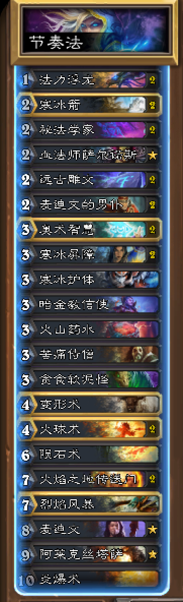

# 天梯模式法师卡组

- 奥秘法

  版本：安戈洛（狂野）

  卡组详情：

  

  卡组代码：
  AAECAf0EBnHAAcMB7gLJDem6Agy7ApUDqwSWBewFgbICo7YC17YC67oCh70CwcECmMQCAA==

  ++++++++++++++++更新分割线+++++++++++++++

  版本：狗头人（狂野）

  卡组详情：

  

- 节奏法

  版本：安戈洛（狂野）

  卡组详情：

  

  卡组代码：AAECAf0EDE3FBO0E7QXsB78I+wyhtwLpugKwvALTxQKWxwIJwAG7ApUDqwSWBaO2Ate2AsHBApjEAgA=

- 无限火球法

  版本：安戈洛（狂野）

  卡组详情：

  

  卡组代码：

  AAEBAf0EBE24CNYRlscCDYoBwAH7AZwCyQOrBMsE5gTtBJYF9w2YxALaxQIA

- 控制法

  版本：女巫森林

  卡组详情：

  

  卡组代码：

  AAECAf0ECooB0AK/CPsM08UCm9MCo+sCmu4Ct/ECxfMCCk3JA+wHm8ICysMClscC1eEC1+ECluQCvuwCAA==

- 奇数控制法

  版本：大乱斗

  卡组详情：

  

  卡组代码：

  AAECAf0ECNAC08UCm9MCluQCw+oCnvgCoIADqIcDC+wH68ICysMCyMcC1+ECt/ECzvICw/gCvfoCpIcDzYkDAA==

- 奇数快攻法

  版本：大乱斗

  卡组详情：

  

  卡组代码：

  AAECAf0EBq8EyssC7vYCnvgCqIcDtogDDJ4BtATsBevCAo/TAtHhAovlAvvsAs/yAr36AqSHA82JAwA=