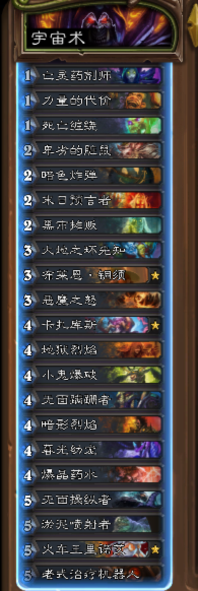
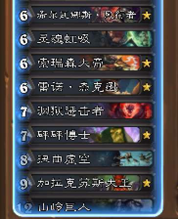
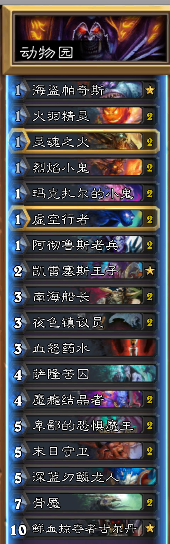
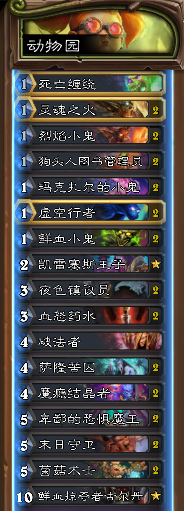
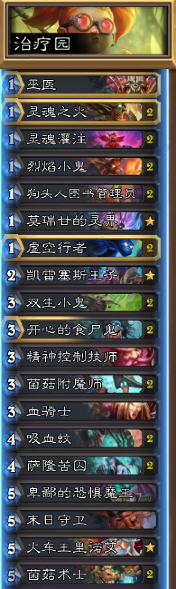
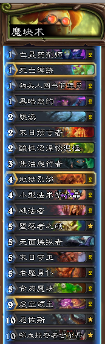
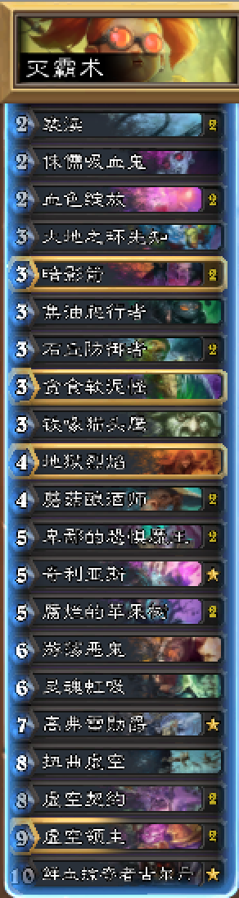

# 天梯模式术士卡组

- 宇宙术

  版本：加基森（狂野）

  卡组详情：

  

  

  卡组代码：

  AAEBAf0GHooBkwGTBK8EiQbOBtsGtgfhB40IxAjMCPMMuQ2BDt0P9Q+eEK0Q1hH9EcMWzxaFF6mtAti7At28Av2/At7EAt/EAgAA

- 动物园

  版本：冰封王座（狂野）

  卡组详情：

  

  卡组代码：

  AAECAf0GBsm7ApG8ApvLAsrLApfTApziAgww9wSoBc4Hwgi0rAK8tgLHuwLrwgL3zQKVzgKmzgIA

  ++++++++++++更新分割线++++++++++++

  版本：狗头人（狂野）

  卡组详情：

  

  卡组代码：

  AAEBAcn1AgTyBcQIl9MCnOICDTDVA/cEzgfCCLSsAry2Ase7Asm7ApvLAvfNAvLQAtHhAgA=

  ++++++++++++更新分割线++++++++++++

  版本：砰砰计划

  卡组详情：

  

  卡组代码：

  AAECAcn1AgiEAa8E9wTeBfMF980CnOICj4IDCzDOB8IIm8sCn84C8tAC0eECh+gC7/EC9PcC0/gCAA==

- 魔块术

  版本：狗头人（狂野）

  卡组详情：

  

  卡组代码：

  AAEBAcn1AgiKAZMEigfECOCsAsrDApfTAtvpAgv3BPIFtgfexALnywLy0AL40AKI0gKL4QL85QLo5wIA

- 灭霸术

  版本：拉斯塔哈大乱斗

  卡组详情：

  

  卡组代码：

  AAECAcn1AgyiAtsGtgfMCPMMysMC08UCrs0CoM4Cl9MCnPgCoIADCZIHm8ICkMcC58sC980C2OUC6OcCxfMC1IYDAA==

- 快乐术